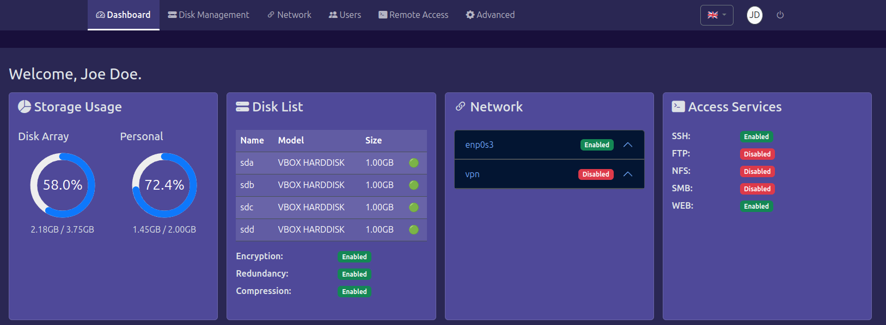
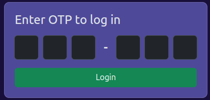
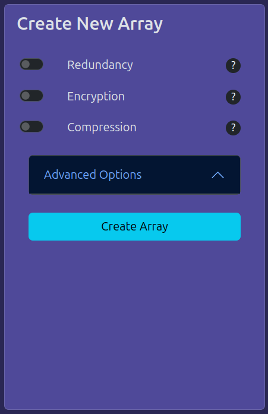
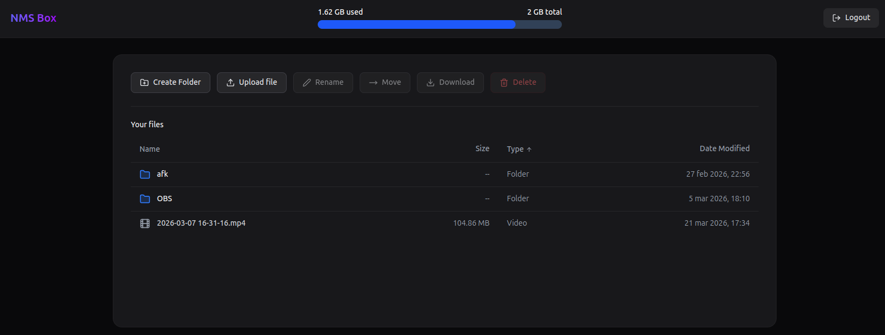

# NMS - NAS Management System


A **lightweight**, **flexible** NAS solution written in Python that runs on **any Linux distribution and architecture**.

Unlike traditional NAS systems, NMS is an **application**, not a full operating system.
Install it on your existing machine, server, or even a Raspberry Pi, and turn it into a fully featured NAS.

Think of NMS as **"TrueNAS, but installable as a normal Linux application"**

NMS is built with simplicity in mind: it combines **advanced features, security, and privacy**, while remaining easy to use.  

Despite its rich feature set, getting started is straightforward and requires minimal effort.

## 🌟 Key Features
* 📦 [OpenZFS](https://openzfs.org/wiki/Main_Page) under the hood for robust file management.
* 👥 Multi-user system with finely-grained access control
* 📃 Quota management
* 📸 Snapshots for data protection and recovery
* 🔐 Encryption for secure storage
* 🗜️ Compression to optimise disk usage
* 🖴 SMART support
* 🌐 Multiple access services: SSH, HTTP/Web interface, SMB (Windows shares), NFS, FTP
* 🔒 Built-in VPN support for secure remote access
* 🌍 Dynamic DNS compatibility (works with most providers)
* 📴 Offline-first design — works fully without internet
* 🍓 Made with ❤️ to be Raspberry Pi compatible
* 🌍 Multilanguage - Languages currently supported: 🇬🇧 🇮🇹


---

## Table of Contents
- [⚙️ How It Works](#-how-it-works)
  - [📁 Installation Structure](#-installation-structure)
  - [🔧 Services](#-services)
  - [👥 User Integration](#-user-integration)
  - [🔐 Security Model](#-security-model)
- [🧰 Install](#-install)
  - [️🚀 Quick Start](#-quick-start)
  - [👩‍💻 Manual Installation](#-manual-installation)
- [🏁 Onboarding](#-onboarding)
- [☺️ Enjoy](#-enjoy)
  - [🖴 Disk Management](#-disk-management)
  - [🔗 Network](#-network)
  - [👥 Users](#-users)
  - [📺 Remote Access](#-remote-access)
  - [⚙️ Advanced](#-advanced)
- [🖴 Creation of a Disk Array](#-creation-of-a-disk-array)
- [🤝 Contributing](#-contributing)
- [🔮 Future Plans](#-future-plans)
- [⚠️ Disclaimer](#-disclaimer)
- [📜 License](#-license)


---

## ⚙️ How It Works

NMS behaves as a **self-contained NAS layer on top of Linux**, rather than replacing the operating system.

### 📁 Installation Structure

All components are installed under `/nms`

This directory contains:
* Backend and frontend applications
* Configuration files
* Internal libraries
* Static assets

### 🔧 Services

NMS installs and manages two system services:

* nmsbackend → handles storage logic, APIs, ZFS operations, and system orchestration
* nmswebapp → provides the web interface and user interaction

Both services are:

* Managed via `systemd`
* Automatically started at boot
* Isolated from the rest of the system

### 👥 User Integration

NMS integrates directly with Linux system users to provide:

* Authentication for remote services (SSH, SMB, FTP, etc.)
* Permission management
* Multi-user isolation

During installation, it may:
* Create system users (e.g., backend, www-data)
* Modify groups and permissions
* Configure access to shared resources

### 🔐 Security Model

- OTP-based authentication for web access
- Optional VPN (WireGuard) for remote connectivity
- Native Linux permissions for service isolation
- ZFS encryption support
- Works fully offline (reduced attack surface)


---

## 🧰 Install

It is required you have Linux installed. This software will not work on Windows.

> ⚠️ **Important Note**
> 
> NMS performs system-level changes (users, services, permissions).
> For this reason, it is strongly recommended to install it on:
> * A clean Linux installation (debian-based is advised)
> * A dedicated machine 
> * Or a virtual machine
> 
>This avoids conflicts with existing services and configurations.

### ️🚀 Quick Start

NMS was conceived to run on a Raspberry Pi, but the guided installation script will work in any debian-based distribution.
This is because NMS was tested on Debian running on a virtual machine.

Simply run the following line on the terminal:

```sh
$ curl -fsSL https://raw.githubusercontent.com/valerio-afk/nms/refs/heads/main/nms_sysconf.sh | sudo bash
```

This operation will take some time (about 5 minutes), at the end of which you should get your system up and running.

> ⚠️
> 
> By running this command, you accept the terms of the CDDL license required for OpenZFS. For more information, [please visit this page](https://en.wikipedia.org/wiki/Common_Development_and_Distribution_License). 

### 👩‍💻 Manual Installation

If you are running a different kind of Linux distribution, you should make the necessary requirement manually.

> ⚠️ **Important Note**
> 
> The following steps assume you have `systemd` installed. If not, you should make the necessary adjustments (and if you are here, it means you are capable of).

<details>
<summary>Step 1: Install Necessary Packages</summary>

NMS expects the following programs and system tools to be installed in your system (debian-based package names):
> * python3-full
> * network-manager
> * nginx
> * sudo
> * docker.io
> * smartmontools
> * "linux-headers-*
> * zfs-dkms
> * zfsutils-linux
> * openssh-server
> * vsftpd
> * samba
> * nfs-kernel-server
> * wireguard
> * rsync
> * unp
> * nodejs
> * npm
> * git
> * jq
> * acl
> * libfile-mimeinfo-perl
> * p7zip-full

You should adapt the name of these packages for your distribution.

Under Debian, zfs compiles a kernel modules and it is required you install the header of the kernel matching the version of the Linux kernel you are running.

At the end of this process, you need to load the `zfs` module:

```sh
$ sudo modprobe zfs
```
</details>

<details>
<summary>Step 2 [Optional]: Disable Installed Services</summary>
`systemd` services for remote access will automatically run. You may disable them for the time being with the following commands:

```sh
$ sudo systemctl stop vsftpd
$ sudo systemctl stop smbd
$ sudo systemctl stop nmbd
$ sudo systemctl stop rpcbind
$ sudo systemctl stop nfs-server

$ sudo systemctl disable vsftpd
$ sudo systemctl disable smbd
$ sudo systemctl disable nmbd
$ sudo systemctl disable rpcbind
$ sudo systemctl disable nfs-server
```
</details>

<details>
<summary>Step 3 [Optional]: Network Management</summary>
If you don't want NMS meddling with networking, you may skip this step (you are still required to install `NetworkManager`).

NMS relies on `NetworkManager` to manage network interface (e.g., ethernet and wifi).
If you'd like that NMS manages your network interfaces, disable the service `networking`.

```sh
$ sudo systemctl stop networking
$ sudo systemctl disable networking
```

Now, open the file `/etc/NetworkManager/NetworkManager.conf` and change the line with `managed=false` in `managed=true`

</details>

<details>
<summary>Step 4: Create Python Virtual Environment (venv) </summary>

Create a new directory where a new python venv will be installed. For the purpose of this documentation, it will be assumed the directory is `/opt/python3`
If you use a different directory, please keep note of it as it will be useful next.

```sh
$ sudo mkdir /opt/python3
```
Now create the venv:

```sh
$ sudo python3 -m venv /opt/python3
```

Now upgrade pip:

```sh
$ sudo /opt/python3/bin/pip install --upgrade pip
```
</details>

<details>
<summary>Step 5: Install NMS</summary>

Download the last release `.tar.xz` compressed file. You should find it either [here](https://github.com/valerio-afk/nms/releases) or on the right-hand side in this repository page.

The archive will be extracted inside `/nms`. If you wish to use a different location, adapt the commands below:

```sh
$ sudo mkdir /nms
```

Now extract the archive (replace VERSION with the actual version of the downloaded NMS):

```sh
$ sudo tar -xf nms-VERSION.tar.xz -C /nms .
```

As NMS is written in Python, you need to install several dependencies. This can be done with the following command (adapt the path to python if you installed it in a different directory):
```sh
$ sudo /opt/python3/bin/pip install -r /nms/requirements.txt
```

Both backend and frontend make use of a shared library. Install this too:

```sh
$ sudo /opt/python3/bin/pip install -e /nms/nms_shared
```

</details>

<details>
<summary>Step 6: Install redis on Docker</summary>

Let's start by pulling `redis` docker image first:

```sh
$ sudo docker pull redis
```

Now run `redis` with the following configuation
```sh
$ sudo docker run -d            \
       --name redis-server      \
       -p 6379:6379             \
       --restart unless-stopped \
       redis
```
</details>

<details>
<summary>Step 7: User Configuration</summary>

The frontend is expected to run as `www-data`. In most of the distros, this user is already present.
Check if it's there by running:

```sh
id www-data
```

If you don't get an error, you may proceed next. Otherwise, create this user with the following configuration:
```sh
$ sudo useradd -M -r -s /usr/sbin/nologin www-data
```

Now, create a user for the backend:
```sh
$ sudo useradd -M -s /usr/sbin/nologin -G sudo backend 
```
The backend user requires to use `sudo` without prompting the password. We need to add the following rule on `sudoers`:

```sh
echo "backend ALL=(ALL) NOPASSWD: ALL" | sudo tee "/etc/sudoers.d/backend"
```

Now create the following groups:
```sh
$ sudo groupadd sambashare
$ sudo groupadd users
```

NMS user management is tied to the Linux users. It expects a user called `user`.
This step is not mandatory and you can assign your own user later.

If you want to create `user` now and have a smoother onboarding, type the following command:
```sh
$ sudo useradd -M -s /bin/bash user  
```
</details>

<details>
<summary>Step 8: Create systemd services</summary>

> ⚠️ **Important Note**
> 
> If you are not running `systemd`, you need to adapt these steps accordingly.

You need to create two system services for the backend and frontend.

> ⚠️ **Important Note**
> 
> Do not follow the following steps blindly, especially if you have created python venv and/or installed NMS in a different directory.
> In the following lines, replace 
> * `PYTHON_DIR` with️ path to python venv (e.g., `/opt/python3`)
> * `NMS_DIR` with️ path to NMS (e.g., `/NMS`)
> * `KEY` with️ path a secret key (you will understand in a bit).

Both backend and frontend require a secret key to operate. It is not required to be the same. It should be an alphanumeric sequence of at least 32 characters.
You can generate one with the following command:

```sh
$ openssl rand -base64 45 | tr -dc 'A-Za-z0-9'
```

It is recommended you run this command twice (for backend and frontend) and copy them in the respective commands: 

First, let's create a `systemd` service for the backend:

```sh
$ cat <<EOF | sudo tee /usr/lib/systemd/system/nmsbackend.service 
[Unit]
Description=NMS Backend FastAPI Service
After=docker.service
Requires=docker.service

[Service]
User=backend
Group=backend
WorkingDirectory=NMS_DIR
Environment="PATH=PYTHON_DIR/bin:$PATH"
Environment="NMS_SECRET_KEY=KEY"
ExecStart=$venv_path/bin/uvicorn backend_server.backend:app --host 127.0.0.1 --port 8081 --reload --log-config logging.yaml
Restart=always
RestartSec=5

[Install]
WantedBy=multi-user.target
EOF
```

Now create a `systemd` service for the frontend:

```sh
cat <<EOF | tee /usr/lib/systemd/system/nmswebapp.service 
[Unit]
Description=NMS Web App Service
After=nmsbackend.service
Requires=nmsbackend.service

[Service]
User=www-data
Group=www-data
WorkingDirectory=NMS_DIR
Environment="PATH=PYTHON_DIR/bin:$PATH"
Environment="NMS_SECRET_KEY=KEY"
ExecStart=$venv_path/bin/uvicorn frontend.app:frontend_app --host 127.0.0.1 --port 8080 --reload --log-config logging.yaml
Restart=always
RestartSec=5

[Install]
WantedBy=multi-user.target
EOF
```

Now you need to start these services:

```sh
$ sudo systemctl daemon-reload
$ sudo systemctl enable nmsbackend
$ sudo systemctl start nmsbackend
$ sudo systemctl enable nmswebapp
$ sudo systemctl start nmswebapp
```

</details>

<details>
<summary>Step 9: VPN Configuration</summary>
The VPN is provided with [Wireguard](https://www.wireguard.com).

Before you proceed, we need to create a pair of private and public keys

> ⚠️ **Important Note**
> 
> Unlike before, do not change directory/filenames of the keys.

Run the following command to create the keys:

```sh
$ wg genkey | sudo tee /root/vpn_private.key | wg pubkey | sudo tee /root/vpn_public.key
```

Now create this Wireguard configuration

```sh
$ cat <<EOF | sudo tee /etc/wireguard/wg0.conf 
[Interface]
Address = 10.0.0.1/24
PrivateKey = /root/vpn_private.key
ListenPort = 51820
EOF
```

Let's reload all the services in `systemd` once again:

```sh
$ sudo systemctl daemon-reload
```
 
</details>

<details>
<summary>Step 9 [Optional]: Reverse Proxy</summary>

`nginx` is a web server that also acts as reverse proxy. As of now, you can access the NMS locally by visiting `http://localhost:8080`.

To access it remotely (still from your local network), you need to configure `nginx` as a reverse proxy as follows:

```sh
cat <<'EOF' | sudo tee /etc/nginx/sites-available/nms 
server
{
    listen 80;
    server_name _;

    location /
    {
        proxy_pass http://127.0.0.1:8080;

        proxy_set_header Host $host;
        proxy_set_header X-Real-IP $remote_addr;
        proxy_set_header X-Forwarded-For $proxy_add_x_forwarded_for;
        proxy_set_header X-ForwardedProto $scheme;

        proxy_http_version 1.1;
        proxy_set_header Upgrade $http_upgrade;
        proxy_set_header Connection "upgrade";
    }

    location /api/
    {
        proxy_pass http://127.0.0.1:8081;

        proxy_set_header Host $host;
        proxy_set_header X-Real-IP $remote_addr;
        proxy_set_header X-Forwarded-For $proxy_add_x_forwarded_for;
        proxy_set_header X-ForwardedProto $scheme;

        proxy_http_version 1.1;
        proxy_set_header Upgrade $http_upgrade;
        proxy_set_header Connection "upgrade";
    }

    location /box
    {
      return 301 /box/;
    }

    location /box/
    {
      alias /nms/box/dist/;
      try_files $uri $uri/ /index.html;
    }

}
EOF
```

Now remove the default configuration:

```sh
$ sudo rm -f /etc/nginx/sites-enabled/default
```

And let's enable NMS configuration:
```sh
sudo ln -sf /etc/nginx/sites-available/nms /etc/nginx/sites-enabled/nms
```

And, lastly, restart `nginx` and you should be good to go:
```sh
$ sudo systemctl restart nginx
``` 
</details>

---

## 🏁 Onboarding

You should identify the IP address of your NMS installation and access it with your browser.

The first thing you need to do is to configure your login credentials. 

> ✔️ **Useful Information**
> 
> Differently than other similar systems, you don't need to configure username and password.
> Login is performed via One-Time Password (OTP). Each NMS user will have a different OTP secret associated.

> ✔️ **Useful Information**
> 
> Username and password are still required to access remotely (e.g., SSH, FTP), but those can be configured later.

> ✔️ **Useful Information**
> 
> You must have an authenticator app installed on your phone, such as Google Authenticator or Microsoft Authenticator

The first thing you will see is a QR code. Scan it with your authenticator app.
Once you are done, you will be taken to the login page where you simply need to prompt the OTP provided by your autheticator app.



---

## ☺️ Enjoy

At this point, you will be taken in the `Dashboard`. Here you will be able to see:

* **Storage Usage:** how big is your disk array and how much space has been used. If the user has a quota associated, personal space usage and limit are also shown.
* **Disk List:** List of disks (hard drives) attached to this device.
* **Network:** Summary information regarding connectivity.
* **Access Services:** Summary information regarding remote services.
* **System Information:** Summary information regarding your system.

Let's have a quick look at the other pages

### 🖴 Disk Management

From here, you can create your disk array. You can also perform other operations:
* **Verify:** verify if all is good with your data (zfs scrub operation) and check results.
* **Snapshots:** you can create snapshots of the current state of the disk array.
* **Mount/Unmount:** you can temporarily detach (unmount) your disk array and attach (mount) as it best suits you.
* **Import:** In case you have a new Linux distribution and an existing OpenZFS disk array (pool), you will be given the opportunity to import it, without the need of creating a new one and browse your data.
* **Check Disk Health:** Through S.M.A.R.T., you can check the state of your disks and replace them when something goes wrong.
* **Replace Disk:** If you need to replace a disk (e.g., too old or broken), do it. Once you have replaced it, visit this page and you will be asked to replace the disk within your disk array.

### 🔗 Network

From here, you can manage network interfaces and connect to wifi networks.

You can also manage the VPN, by adding the public keys of other devices (peers).

You can also manage the following Dynamic DNS (DDNS) providers
> * No-IP
> * DuckDNS
> * Dynu
> * FreeDNS
> * DNSExit
> * DynV6
> * ClouDNS

### 👥 Users

You can create, edit, delete users. If you are the only user of your NAS, you don't need to dwell much in this page.

If needed, you can reset your OTP secret from here.

Each NMS user is associated with a system user, as it's necessary to use the Remote Access services.

> ✔️ **Useful Information**
> 
> By default, your user does not have `sudo` permission. It is recommended to do so when you are performing critical operations, such that you can restore your system via SSH if something goes wrong.


### 📺 Remote Access

In this page, you can activate and deactivate the following access services:
> * `SSH`: go to your account page to set an SSH password.
> * `FTP`: this services relies on system users to log in. The password set for SSH will also allow you to log in via FTP
> * `NFS`: no login is required. Access control is guaranteed via IP address.
> * `SMB`: Windows share (SMB) uses different credentials. Although the username remains the same, go to your account page to set a password.
> * `WEB`: OTP login. [See box to learn more](#-box).

This page will also explain how to access them remotely with different operating systems.

### ⚙️ Advanced

Here you can do some advanced operations:
* Read the system logs
* Restart the system services
* Download encryption keys (if your disk array is encrypted)
* Perform system updates

>⚠️ **Important Note**
> 
> If you have performed a manual installation (non-debian) and deviated from the standard configuration (e.g., installed /nms elsewhere), you won't be able to perform updates from here and you are required to do them manually.  

>⚠️ **DANGER ZONE**
> 
> The operations in the red box are dangerous and may cause loss of data. Due to the nature of these functionality, you are required to insert your OTP again and confirm the operation before proceeding. Be careful when:
> * **Format the disk array:** this operation basically destroys and recreates a new disk array with the same parameters as the current one.
> * **Destroy disk array:** destroy the disk array. You may create a new one in the `Disk Management` page.
> * **Format disk:** initialise (format) an individual disk (sometimes it may be required for new disk).
> * **Attempt recovery:** attempt recovery in case of data corruption
> 
> **ANY OF THESE OPERATIONS MAY CAUSE DATA LOSS.**

## 🖴 Creation of a Disk Array

A disk array (or pool) is the virtual disk created by merging several physical hard disks. It adds up the size of each individual disks and treat them as one.

> ✔️ **Useful Information**
> 
> To take the most of your NAS, it is highly recommended to install disks of the same size. Sometimes, it is recommended to buy disks for different brands, as long as their sizes match.



When creating a disk array, you can choose to enable the following options

* **Redundancy:** Using a minimum of 3 disks, the system will use 1/3 of the space to generate redundancy information. Although you will have 1/3 (or 1/4 with 4 disks) less disk space at your disposal, this setting is crucial to recover data if one disk physically breaks down.
* **Compression:** Internally, data will be compressed and this operation is completely transparent to you. However, this comes to the cost of slower writing and reading operations. If you are considering to use your NAS for data archival, data compression is something you ought to consider.
* **Encryption:** Internally, data are encrypted, so that no one can access them without the proper encryption key. 

>⚠️ **Important Note**
> 
> Without redundancy, if one disk is plugged out or gets damaged, you won't be able to use your data any more. Although your are free to opt out, it is highly recommended you make use of redundancy.  

>⚠️ **Important Note**
> 
> If you are using encryption, you must download the encryption key from the `Advanced` page. In case you need to reinstall your system, you won't be able to import your disk array without this key. Given how OpenZFS operates, there is no way to recover your data without the encryption key.  

---

## 📦 Box

MS includes a built-in **lightweight web-based file browser**.

If you have used services like Dropbox, OneDrive, or Google Drive, the concept should feel familiar.

Box is a **multi-user, self-hosted file management web application** written in React.  
Although it is separated from the main admin dashboard, it shares the same authentication system, user accounts, and backend, making it fully integrated with NMS.




### 🤔 Why not use an off-the-shelf solution?

Several existing solutions were evaluated, but none were fully aligned with NMS design goals.

Below is a summary of the main alternatives considered and why they were not adopted:

#### **Nextcloud**
- Very large and complex project  
- Concerns about performance and resource usage, especially on low-power devices like Raspberry Pi<sup>[1]</sup>


#### **FileBrowser**
- Runs under a single system user  
- All uploaded files would be owned by that user rather than the actual uploader  

This creates:
- ❌ Permission inconsistencies<sup>[2]</sup>
- ❌ Potential quota bypass  
- ❌ Misalignment with Linux user-based access control  

#### **MinIO**
- Provides both a web interface and an S3-compatible API  

However:
- Files are treated as **objects (data + metadata)** rather than standard filesystem entries  
- This breaks compatibility with other access methods (e.g., SMB, NFS, SSH)

### 🎯 Summary

Box exists to provide:

- ✅ Proper multi-user file ownership  
- ✅ Seamless integration with Linux permissions  
- ✅ Compatibility with all access protocols (SMB, NFS, SSH, etc.)  
- ✅ A lightweight and consistent user experience  

> In short: **a file manager that behaves correctly within a real filesystem, not an abstraction on top of it.**

### 🗒️ Notes

[1] OpenZFS can be memory-intensive, especially with large storage pools.  
Since NMS prioritises storage reliability and performance, introducing a heavy application like Nextcloud could compromise system efficiency—particularly on resource-constrained devices.

[2] A potential workaround for FileBrowser (e.g., using `inotify` to reassign file ownership) was explored.  
However, `inotify` does not appear to behave reliably with OpenZFS in this context.  
It is unclear whether this is due to OpenZFS limitations or environmental factors, and it may be investigated further.

---
## 🛡 VPN & Remote Access

NMS includes built-in support for a VPN using **WireGuard**, providing a secure way to access your NAS remotely.

> ⚠️ **Important Note**
> 
> It is strongly discouraged to expose your NAS directly to the internet via port forwarding (e.g., port 80).
> 
> Opening HTTP port:
> * Exposes your system to automated scans and attacks 
> * Increases the risk of unauthorised access 
> * Requires additional hardening (TLS, firewall rules, intrusion detection, etc.)

Instead of exposing web services, it is much safer to:

* Forward only the WireGuard VPN port: 51820
* Access your NAS through the VPN tunnel

### ⚙️ Port Forwarding (Generic Steps)

> ⚠️ **Important Note**
> 
> The exact steps depend on your router model and firmware.

In general, you will need to:

1. Log into your router’s admin interface (typically 192.168.0.1 or 192.168.1.1)
1. Locate the Port Forwarding or NAT section
1. Create a new rule:
   * External Port: 51820
   * Internal IP: IP address of your NMS server
   * Internal Port: 51820
   * Protocol: UDP
1. Save and apply the configuration

Once the VPN is enabled in the `Network` page and your device(s) public keys have been added, connect from your remote device(s) and access NMS at: `http://10.0.0.1`.

---
## 🤝 Contributing

Contributions, translations, issues, and feature requests are welcome!

In interested, learn more about the backend [API endpoints](API.md).


---

## 🔮 Future Plans

* Add S3-compatible remote access services. 

---

## ⚠️ Disclaimer

This project is under active development.
Use in production environments with caution and proper backups.

THE SOFTWARE IS PROVIDED "AS IS", WITHOUT WARRANTY OF ANY KIND,
EXPRESS OR IMPLIED, INCLUDING BUT NOT LIMITED TO THE WARRANTIES
OF MERCHANTABILITY, FITNESS FOR A PARTICULAR PURPOSE AND
NONINFRINGEMENT. IN NO EVENT SHALL THE AUTHORS OR COPYRIGHT
HOLDERS BE LIABLE FOR ANY CLAIM, DAMAGES OR OTHER LIABILITY,
WHETHER IN AN ACTION OF CONTRACT, TORT OR OTHERWISE, ARISING
FROM, OUT OF OR IN CONNECTION WITH THE SOFTWARE OR THE USE OR
OTHER DEALINGS IN THE SOFTWARE.

--- 

## 📜 License

NMS is provided under [GNU GPL 3.0 license agreement](https://www.gnu.org/licenses/gpl-3.0.en.html).
Specifically, this includes:
* Flask Frontend
* React Frontend (Box)
* FastAPI backend
* NMS shared library (nms_shared)

Other software distributed with this repository are:
* Bootstrap 5.3.8: [MIT License](https://mit-license.org)
* Morphdom 2.7.8: [MIT License](https://mit-license.org)
* Showdown 2.1.0: [MIT License](https://mit-license.org)